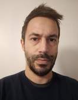

  <h1>Leonardo Ciman</h1>
  

- E-mail: <leonardo.ciman@gmail.com>
- Indirizzo: Via Cengio 39, Vicenza 36100 (VI)  
- Data di nascita: 28 Giugno 1982  

## Esperienza Professionale

`da Giugno 2010`
__Satelicom s.r.l. (ex AMA Applicazioni Mobili Avanzate s.r.l.), Vicenza__  
L'azienda è specializzata nell’ambito di sistemi ICT con particolare attenzione alla  
geo-localizzazione coprendo l’intero spettro dello sviluppo di un dispositivo: hardware,  
firmware e software (gestione remota).  
Il mio ruolo principale consiste nello sviluppo e gestione di diversi servizi di backend che  
devono interagire con periferiche remote di vario genere (per la maggior parte localizzatori  
satellittari) sviluppate internamente o anche di terze parti.  
Gestisco anche lo sviluppo di alcune app Android con focus sulla comunicazione via bluetooth  
e l’utilizzo di web-service.  
Per necessità aziendali interne ho sviluppato vari script per l’automazione di processi e la  
creazione di report e statistiche principalmente tramite powershell e python.  

`Luglio - Settembre 2008`
__Glaxo Smith Kline, Verona__  
Stage con l’obiettivo di creare un set di test automatici (tramite Quick Test Professional)  
per la verifica di un software sviluppato internamente.

`Febbraio - Marzo 2005`
__Intesys s.r.l. , Verona__  
Contratto a progetto per lo sviluppo di un webservice in ambito ospedaliero tramite  
l’utilizzo del framework Apache Axis.

`Luglio - Ottobre 2004`
__Intesys s.r.l. , Verona__
Stage come programmatore Java.

## Istruzione e Formazione

`Marzo 2010`
__Laurea Magistrale in Informatica__
- Università degli Studi di Verona
- Tesi: Sviluppo e progettazione di una piattaforma per
l'emulazione di protocolli di sicurezza.

`Maggio - Novembre 2006`
__IELTS English Course__
- Castle Schoool of English(Brighton, Inghilterra)

`Marzo 2006`
__Laurea Triennale in Informatica__
- Università degli Studi di Verona
- Tesi: Progettazione e sviluppo di web-services con Apache Axis.

## Lingue

`Italiano`
Madrelingua

`Inglese`
Buono

## Conoscenze Informatiche

  

    
|Linguaggi |                                               |
|:--------|-----------------------------------------------:|
|C#       |<progress value="100" max="100">100 %</progress>|
|C++      |<progress value="100" max="100">100 %</progress>|
|Java     |<progress value="75" max="100">75 %</progress>  |
|C        |<progress value="75" max="100">75 %</progress>  |
|Assembly |<progress value="25" max="100">25 %</progress>  |
|         |                                                |
|__Sviluppo App__ |                                        |
|Kotlin   |<progress value="100" max="100">100 %</progress>|
|Android Studio|<progress value="100" max="100">100 %</progress>|    
|         |                                                |
|__Scripting__ |                                           |
|Powershell|<progress value="100" max="100">100 %</progress>|
|Python   |<progress value="50" max="100">50 %</progress>  |
|Bash     |<progress value="25" max="100">25 %</progress>  |

  

  

    
|Sviluppo Web |                                           |
|:--------|----------------------------------------------:|
|JavaScript|<progress value="75" max="100">75 %</progress>|
|HTML     |<progress value="75" max="100">75 %</progress>|
|XML      |<progress value="75" max="100">75 %</progress>|
|CSS      |<progress value="75" max="100">75 %</progress>|
|PHP      |<progress value="50" max="100">50 %</progress>|
|         |                                              |
|__Database__ |                                          |
|Sql Server|<progress value="100" max="100">100 %</progress>|
|Sqlite    |<progress value="100" max="100">100 %</progress>|
|Mysql     |<progress value="75" max="100">75 %</progress>|
|PostgreSql|<progress value="50" max="100">50 %</progress>|     

  

## Interessi
Sono un amante degli sport. Pratico trail-running, snowboard e trekking ...

I enjoy team sports. I love all mountain sports: snowboarding, trekking, skiing . . .
The amazing landscapes encounterd during my mountain trips prompted me to take up photography. I’m
currently attending a photography course to improve my skills.

<!-- ### Footer Last updated: May 2024 -->

